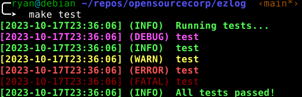

# ezlog - Simple unstructured logging for Bash

`ezlog` provides an interface for simple logging in `bash` programs. It contains
functions named `log-<level>`, where `<level>` is a log level name found in the
table below.

[]

## How to use

To use, just clone this repo locally, and source the `src/main.sh` file. Then,
the `log-*` functions will be available to use in your scripts.

## Log levels

Five levels are supported, and can be toggled with the `LOG_LEVEL` environment
variable, either using the level name or its corresponding code number:

| Log level name | Log level code |
| :------------- | :------------- |
| `fatal`        | `1`            |
| `error`        | `2`            |
| `warn`         | `3`            |
| `info`         | `4`            |
| `debug`        | `5`            |

To completely disable logging, set `LOG_LEVEL=0` (or really, just anything less
than `1`).
