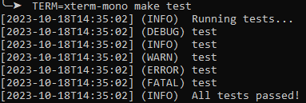

# ezlog - Simple unstructured logging for Bash

`ezlog` provides an interface for simple logging in `bash` programs. It contains
functions named `log-<level>`, where `<level>` is a log level name.

## Log levels

Five levels are supported, and can be toggled with the `LOG_LEVEL` environment
variable, either using the level name or its corresponding code number:

| Log level name | Log level code | Corresponding log function |
| :------------- | :------------- | :------------------------- |
| `fatal`        | `1`            | `log-fatal`                |
| `error`        | `2`            | `log-error`                |
| `warn`         | `3`            | `log-warn`                 |
| `info`         | `4`            | `log-info`                 |
| `debug`        | `5`            | `log-debug`                |

To completely disable logging, set `LOG_LEVEL=0` (or really, just anything less
than `1`).

## ANSI color output

`ezlog` defaults to printing colored output. It will try determine if your
terminal supports color output or not, though:

## How to use

To use, just clone this repo locally, and source the `src/main.sh` file. Then,
the `log-*` functions will be available to use in your scripts.
