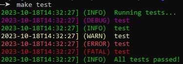

# ezlog - Simple unstructured logging for Bash

`ezlog` provides an interface for simple logging in `bash` programs. It contains
functions named `log-<level>`, where `<level>` is a log level name.



## Log levels

Multiple levels are supported, and can be toggled with the `EZLOG_LEVEL`
environment variable, either using the level name or its corresponding code
number:

| Log level name | Log level code | Corresponding log function |
| :------------- | :------------- | :------------------------- |
| `fatal`        | `1`            | `log-fatal`                |
| `error`        | `2`            | `log-error`                |
| `warn`         | `3`            | `log-warn`                 |
| `info`         | `4`            | `log-info`                 |
| `debug`        | `5`            | `log-debug`                |

To completely disable logging, set `EZLOG_LEVEL=0` (or really, just anything
less than `1`). It *must* be set though, because an unset `EZLOG_LEVEL` will
default to the `info` level.

## ANSI color output

`ezlog` defaults to printing colored output. It will try to determine if your
terminal supports color output or not, though:


## How to use

The recommended way to get `ezlog` & use the library is by way of
[`bashpack`](https://github.com/opensourcecorp/bashpack):

```bash
source "$(bashpack mainpath 'https://github.com/opensourcecorp/ezlog')"
```

Then, the `log-*` functions will be available to use in your scripts.

Realistically, you can get `ezlog` however you want though -- the lowest-common
denominator is to just clone this repo locally, and `source` the `src/main.sh`
file.

## Developing

Developing `ezlog` requires `bash`, the `bats` testing framework, and the
`shellcheck` linter.
